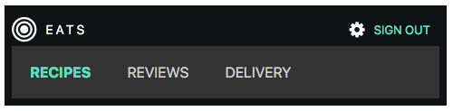

#Session One

##Homework - TBD

1. Complete the navbar exersize as outlined in class
1. Bring your laptop to the next class. 
1. Create a free Github account
1. Download Sublime text and install [Package Manager](https://packagecontrol.io/installation)
1. Install [node.js](https://nodejs.org/en/) and [GIT](https://git-scm.com/book/en/v2/Getting-Started-Installing-Git) on your laptop.


##Text Books

Mat Marquis - [JavaScript for Web Designers](https://abookapart.com/products/javascript-for-web-designers)

Ethan Marcotte - [Responsive Web Design](https://abookapart.com/products/responsive-web-design)

Dan Cederholm - [SASS for Web Designers](https://abookapart.com/products/sass-for-web-designers)

David Demaree - [GIT For Humans](https://abookapart.com/products/git-for-humans)

[Syllabus](http://mean.deverell.com/syllabus/)


##Text Editor - Sublime

Packages - Sublime Package Manager

1. Open package control Tools → Command Palette and type Install Package
2. Search for Cobalt2 and hit enter
3. Penultimately, open Preferences → Settings - User. Add the following lines (only the first two are required): 
   
   ```json
    "color_scheme": "Packages/Theme - Cobalt2/cobalt2.tmTheme",
    "theme": "Cobalt2.sublime-theme",   
    "highlight_line": true,
    "indent_guide_options": [ "draw_normal", "draw_active" ],
    "highlight_modified_tabs": true,
    "line_padding_bottom": 1,
    "line_padding_top": 1,
    "wide_caret": true,
    "caret_extra_bottom": 2,
    "caret_extra_top": 2,
    "caret_extra_width": 3,
    "caret_style": "phase",
    "bold_folder_labels": true,
   ```

4. Restart Sublime for the Theme to be fully applied.

color_scheme defines how the code looks and theme defines how the sidebar, tabs, search, command palette work.


##Variables

basic-DOM > index.html

```
var width = 100;
let height = 200;
const testString = '123456';
```

* var - can be redeclared and reassigned

* var - is function scoped:

```
function setWidth(){
  var width = 500;
  console.log('inner ' + width);
}
setWidth();
console.log(width);
```

Install Sublime [ConsoleWrap addon](https://packagecontrol.io/packages/Console%20Wrap%20for%20js)

* var - can 'leak' when its not inside a function:

```
if ( width > 12 ) {
  var someMultiple = 4;
  var result = width * someMultiple;
  console.log(width + ' times ' + someMultiple + ' equals ' + result)
}
console.log(someMultiple);
```

Here, both someMultiple and result 'leak' outside the block.

* let and const are scoped to the block (function and otherwise - anywhere we have curly brackets)

```
if ( width > 12 ) {
  let someMultiple = 4;
  let result = width * someMultiple;
  console.log(width + ' times ' + someMultiple + ' equals ' + result)
}
console.log(result);
```

Additionally `let` variables can only be declared once

```
let height = 300;
```

Although they can be reassigned:

```
let height = 200;
height = 300
```

And, since they are blockscoped this is allowed:

```
var width = 100;
let height = 200;
height = 300;
const testString = '123456';

if (height > 10){
    let height = 500;
}
console.log(height);
```

* const variables cannot be reassigned

```
testString = 'abcd1234'
```

But they are not immutable, they just create an immutable binding.

```
const me = {
  hair: true,
  age: 48
}
me.age = 49;
```


##Step One

Replace the existing nav items with items from an array.

```
const navItems = ['LOGO', 'Watchlist', 'Research', 'Markets', 'Workbook', 'Connect', 'Desktop', 'FAQ'];
```

querySelector() vs getElementById()

```
var nav = document.getElementById('main');
const nav = document.querySelector('#main');
console.log(nav);
```

querySelectorAll()

```
const navList = nav.querySelectorAll('li a');
console.log(navList);
```

Compare navList and navItems in the console and the Array vs nodeList prototypes.

* for loop and innerHTML

```
for (let i =0; i < navList.length; i++ ){
  navList[i].innerHTML = navItems[i];
}
console.log(i)
```

##Step Two

Problem: we are using existing `<li>` elements but have fewer of them than there are items in our array. 

Solution: dynamically generate the nav from items in the array.

* depopulate the nav children:

```
<nav id="main"></nav>
```

* createElement, appendChild

* Append an `<ul>` tag to nav: 

```
// const navList = nav.querySelectorAll('li a');
var navList = document.createElement('ul');
nav.appendChild(navList);
```

* dynamically create the nav based on the number of items in the array:

```
for (let i =0; i < navItems.length; i++ ){
  let listItem = document.createElement('li');
  let link = '#';
  let linkText = navItems[i];
  listItem.innerHTML = '<a href="' + link + '">' + linkText + '</a>';
  navList.appendChild(listItem);
}
```

Note how gracefully the CSS for the navbar (flex) accomodates the increased number of links.

Switch out the concatenation for a template string:

```
  listItem.innerHTML = `<a href="${link}">${linkText}</a>`;
```

Refactor 

```
for (let i =0; i < navItems.length; i++ ){
  var listItem = document.createElement('li');
  listItem.innerHTML = `<a href="#">${navItems[i]}</a>`;
  navList.appendChild(listItem);
}
```

Check out https://babeljs.io


##Objects

Introduction to objects - `objects.html`

```
const twitter = me.links.social.twitter
```

Destructuring

```
const { first, last } = me;
```

```
const { twitter, facebook } = me.links.social;
```

Change the variable name:

```
const { twitter:tw, facebook:fb } = me.links.social;
```

Examine faq.js as a sample of an object.


##Back to Layout

Links for our page - an array that contains multiple objects:

```
var navItemsObj = [
{
  label: 'LOGO',
  link: '#'
},
{
  label: 'Watchlist',
  link: '#watchlist'
}, 
{
  label: 'Research',
  link: '#research'
},
{
  label: 'Markets',
  link: '#markets'
},
    {
  label: 'Workbook',
  link: '#workbook'
},
    {
  label: 'Connect',
  link: '#connect'
},
    {
  label: 'Desktop',
  link: '#desktop'
},
    {
  label: 'FAQ',
  link: '#faq'
}
];
```

```
for (let i =0; i < navItemsObj.length; i++ ){
  var listItem = document.createElement('li');
  listItem.innerHTML = `<a href="${navItemsObj[i].link}">${navItemsObj[i].label}</a>`;
  navList.appendChild(listItem);
}
```

##Array Methods

```
const markup = `
  <ul>
    ${navItemsObj.map( function(listItem) { 
    `<li>${listItem.link} - ${listItem.label}</li>` 
    })}
  </ul>
`;
console.log(markup)
```


##Sticky Menu

offSetTop

```
let topOfNav = nav.offsetTop;
```

* addEventListener('event', function)

```
window.addEventListener('scroll', fixNav);
```

scrollY

```
function fixNav() {
  console.log(topOfNav)
  console.log(window.scrollY)
}
```

classList 

```
function fixNav() {
  if(window.scrollY >= topOfNav) {
    document.body.classList.add('fixed-nav');
  }
}
```

Note that we add the class to the body (as opposed to - say - the nav itself) so that we can use it to target other elements on the page which may not be children of the nav.

```
function fixNav() {
  console.log(window.scrollY)
  if(window.scrollY >= topOfNav) {
    document.body.classList.add('fixed-nav');
  } else {
    document.body.classList.remove('fixed-nav');
  }
}
```

```
body.fixed-nav nav {
  position: fixed;
  box-shadow:0 5px 3px rgba(0,0,0,0.1);
}
```

```
.site-wrap {
  max-width: 780px;
  margin: 40px auto;
  background:white;
  padding:40px;
  text-align: justify;
  box-shadow: 0 0 10px 5px rgba(0, 0, 0, 0.05);
  /* add these two */
  transform: scale(0.98);
  transition: transform 0.5s;
}

```

```
body.fixed-nav .site-wrap {
  transform: scale(1);
}
```

When the nav gets position fixed it no longer takes up space in the window so the content beneath it jumps upward (reflows).

Take care of the jankey jump using offsetHeight to add padding equal to the height of the nav. 

```
function fixNav() {
  if(window.scrollY >= topOfNav) {
    document.body.style.paddingTop = nav.offsetHeight + 'px';
    document.body.classList.add('fixed-nav');
  } else {
    document.body.classList.remove('fixed-nav');
    document.body.style.paddingTop = 0;
  }
}
```

Note the use of camel case.

```
for (let i =0; i < navItemsObj.length; i++ ){
  var listItem = document.createElement('li');
  listItem.innerHTML = `<a href="${navItemsObj[i].link}">${navItemsObj[i].label}</a>`;
  navList.appendChild(listItem);
  if (i == 0){
    console.log(navList.firstChild)
  }
}
```

Using setAttribute instead of classList:

```
  if (i == 0){
    navList.firstChild.setAttribute('class', 'logo')
  }
```

```
if (navItemsObj[i].label = 'LOGO'){
  navList.firstChild.setAttribute('class', 'logo');
  document.querySelector('.logo').firstChild.innerHTML = '';
}
```

Or without the use of the loop

```
var logo = document.querySelector('#main ul li');
logo.classList.add('logo');
logo.firstChild.innerHTML = '';
```

===

### Notes on SVG

http://responsivelogos.co.uk

http://www.svgeneration.com/recipes/Beam-Center/

===

```
li.logo img {
  padding-top: 0.25rem;
  width: 2.5rem;
}

li.logo {
  max-width:0;
  overflow: hidden;
  background: white;
  transition: all 0.5s;
  font-weight: 600;
  font-size: 30px;
}

.fixed-nav li.logo {
  max-width:500px;
}
```

Note the use of max-width above. We are using this because transitions do not animate with width.


##CSS Flexible Box Layout Module

* A simple guide to the various CSS properties on [CSS Tricks](https://css-tricks.com/snippets/css/a-guide-to-flexbox/)

```
<ul> <!--parent element-->
  <li></li> <!--first child element-->
  <li></li> <!--second child element-->
  <li></li> <!--third child element-->
</ul>
```



```
@import url(https://fonts.googleapis.com/css?family=Roboto:400,700);

body {
  font-family: 'Roboto', sans-serif;
  font-family: -apple-system, BlinkMacSystemFont, "Segoe UI", Roboto, Helvetica, Arial, sans-serif, "Apple Color Emoji", "Segoe UI Emoji", "Segoe UI Symbol";
}

.site-nav ul {
  list-style: none;
  display: flex;
  margin: 0;
  padding: 0;
}

.site-header {
  background: #0D1313;
  color: white;
  display: flex;
  align-items: center;
  padding:0.5rem;
}

li {
  width: 100px;
  height: 100px;
  background-color: #8cacea;
  margin: 8px;
}

.account-dropdown ul {
  display: none;
}

.logo {
  text-decoration: none;
  color: white;
  font-size: 0.9rem;
  text-transform: uppercase;
  letter-spacing: 3px;
  padding: 10px;
}

a {
  text-transform: uppercase;
  text-decoration: none;
  color: #CDD0D0;
  padding: 20px;
  display: inline-block;
}
.active a {
  font-weight: bold;
  color: #62DEBE;
  background: darken(#62DEBE, 40%);
}

.account-actions {
  margin-left: auto;
  display: flex;
  align-items: center;
  margin-right: 10px;
}

.sign-out-link {
  color: #62DEBE;
  font-size: 0.8rem;
  margin-left: 10px;
  text-transform: uppercase;
}

@media (max-width: 600px) {
  .site-header {
    flex-wrap: wrap;
  }
  .site-nav {
    order: 2;
    background: #333;
    width: 100%;
  }
}
```
[Font Awesome](http://fontawesome.io/)
```

<link rel="stylesheet" href="font-awesome-4.6.3/css/font-awesome.min.css">

<i class="fa fa-bullseye fa-3x"></i>

<i class="fa fa-gear"></i>

```

```
<p>Create an object with a new set of labels and links for the site-nav</p>

<p>Use JavaScript to dynamically generate the unordered list</p>

<p>Use classList to assign the active class to a link when clicked (be sure to remove it from the previously highlighted link as well)</p>

<p>Add some content to the page and make the navigation sticky</p>

```

##Responsive

* Mobile first design

* Use min-width media queries to add features to larger screens `@media (min-width: 46.25em) { }`

* Use the meta tag `<meta name="viewport" content="width=device-width, initial-scale=1.0">` to ensure this works on devices 

[Viewport Demo for Phone](http://daniel.deverell.com/css-files/responsive-meta-example/)


##SASS

* error checking - watch out for this

* variables - added padding and breakpoint

* imports and structure

[Bootstrap SASS](https://github.com/twbs/bootstrap-sass)


##GIT and GITHUB

Git Config (typically only need to do this once on your machine)
```
git config
git config --global user.name "DannyBoyNYC"
git config --global user.email "daniel.deverell@gmail.com"
git config --list
```
* make sure terminal is in the correct directory
```
git init
```
Examine the .git Directory
```
ls -al
cd .git
ls
cd ..
```
Git Status
```
git status
On branch master
```
Git doesn't auto track files - only those you tell it to. Adding files creates untracked files. Create and add .gitignore run status.
```
git status
git commit -m 'initial commit'
```
Note: By default `git commit` goes into VIM. Avoid this (unless you like VM). If this happens, hit ESC and type “:q” to exit.

```
git status
On branch master
nothing to commit, working directory clean
```
```
git branch
git branch <branchname>
git checkout <branchname>
git diff
```
To merge branches 
* be in the branch you want to merge to
* run status on that branch to make sure nothing is odd
```
git checkout master
git status
git merge <branchname>
```
Other useful branch commands (delete, show unmerged and merged branches)
```
git branch -d <branchname>
git branch --no-merge
git branch --merged
```
Pushing Files to Remote Repos - Github
* Copy URL from github.
```
git remote add origin https://github.com/.../...
git push -u origin master
```


###Notes

[vh and vw in the CSS](https://css-tricks.com/viewport-sized-typography/)

