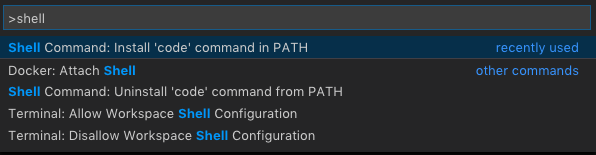

# I - JavaScript and DOM Manipulation

Today we begin introducing much of the JavaScript you will need for this semester - arrays, objects, template strings, and functions. We will be doing this in the context of DOM scripting. DOM is an acronym for Document Object Model.

Install [Visual Studio Code](https://code.visualstudio.com/) on your laptop now.

Install [Node.js](https://nodejs.org/en/) on your laptop now.

## Syllabus

[Syllabus](http://daniel.deverell.com/syllabii/_intermediate-syllabus.pdf)

## Homework

Review the notes below. Download and unzip the files as completed by me at the end of the class [here](https://github.com/front-end-intermediate/session-1/tree/fall2018-done). 'cd' into the directory and run `npm install` and then `npm run start`. Add a new category of New York Times articles using _your own_ api key.

Here are the [NY Times](https://developer.nytimes.com) instructions for getting a key. You can get a key [here](https://developer.nytimes.com/signup).

The specific API endpoint you want for this one is their [top stories endpoint](https://developer.nytimes.com/top_stories_v2.json). It let’s you request the top stories from a specific section of their publication.

```
https://api.nytimes.com/svc/topstories/v2/{section_name}.json?api-key=1234_my_api_key_5678
```


## Reading etc.

* Watch this video on Node and NPM: [Node.js Tutorial for Absolute Beginners](https://youtu.be/U8XF6AFGqlc) on YouTube
* Install [GIT](https://git-scm.com/book/en/v2/Getting-Started-Installing-Git) on your laptop
* Create a Github account

## VSCode

Install [Visual Studio Code](https://code.visualstudio.com/) on your laptop now.

In this class we will be using [Visual Studio Code](https://code.visualstudio.com/) as our editor. We will discuss its features as needed. For today we will take care of some basic configuration details.

In VSCode press `cmd + shift + p` and type in the word `shell`. Select `Install code command in PATH`




## The Command Line

In this class you are goig to need to have a minimal set of terminal commands at your disposal.

Note: Windows users normally use Powershell (run as Administrator) but can try the Git Bash terminal that is installed along with Git when things go wrong. Some of the commands below may be different on Windows or have alternatives.

Start the terminal app (Mac OS) or PowerShell (Windows).

```sh
$ cd  // change directory
$ cd ~  // go to your home directory
$ cd <PATH>  // Mac: copy and paste the folder you want to go to
$ cd Desk  // tab completion
$ cd ..  // go up one level
$ ls  // list files, dir on a PC
$ ls -al  // list file with flags that expand the command
$ pwd  // print working directory
```

`cd` into today's working directory and type:

```sh
$ code .
```

## Node Package Manager

[Node Package Manager](https://www.npmjs.com) is an essential part of the web design and development ecosystem. [Node](https://nodejs.org/en/) includes NPM as part of its install.

Install [node.js](https://nodejs.org/en/) on your laptop now.

`cd` into today's working directory and type:

```sh
$ code .
```

Open the integrated terminal in VSCode (`View > Terminal`) with `ctrl + ~` (control + tilde).

For our first foray into NPM we will install and use [Browser Sync](https://www.browsersync.io).

```sh
$ npm init -y
```

* `npm init -y` creates `package.json` - examine it.

```sh
$ npm install browser-sync --save-dev
```

* `npm install browser-sync --save-dev` installs [Browser Sync](https://www.browsersync.io) into a newly created `node_modules` folder. `--save-dev` adds the software to a list of development dependencies in `package.json` - examine it.

```sh
touch .gitignore
```

`touch .gitignore` creates a `.gitignore` file. Edit and add `node_modules`, save and close. Git will not track the `node_modules` folder.

### Editing package.json

* Browser Sync [Command Line (CLI) documentation](https://www.browsersync.io/docs/command-line)
* [Github Repo](https://github.com/BrowserSync/browser-sync)

Create the NPM script using the Browser Sync command line documentation:

```js
  "scripts": {
    "start": "browser-sync start --server 'app' --files 'app'"
  },
```

And run the process:

```sh
$ npm run start
```


This will open `index.html` in your browser - examine the html and css in the inspector.

Note: Browser Sync has an interface running at port 3001: [http://localhost:3001](http://localhost:3001)

## DOM Scripting

DOM scripting is JavaScript in the browser. The HTML DOM (Document Object Model) specification allows JavaScript to access and manipulate the elements of an HTML document.

<!-- See the [Mozilla Developer's Network](https://developer.mozilla.org/en-US/docs/Web/JavaScript) entry on JS and on [DOM](https://developer.mozilla.org/en-US/docs/Web/API/Document_Object_Model) scripting. -->

The process we will use is:

1. Select an html element to work on
1. Add an event listener to the selected element (e.g.click)
1. Create commands to run when the event occurs on the listener

### Selecting elements in the DOM

Use document`.querySelectorAll()` to find all matching elements on a page. You can use any valid CSS selector.

```js
// Get all links in the nav
var elems = document.querySelectorAll('#main a');

// Get all paragraphs
var elemsPara = document.querySelectorAll('p');
```

Returns a NodeList.

Use `document.querySelector()` (without the 'All') to find the first matching element on a page.

```js
// The first div
var elem = document.querySelector('div');

// The first link
var elemLink = document.querySelectorAll('#main a');

// The first div with a data attribute of main
var elem = document.querySelector('[data-headline="main"]');

// An element that doesn't exist
var elemNone = document.querySelector('.foo');
```

Returns an HTML element

If an element isn’t found, `querySelector()` returns null. If you try to do something with the nonexistant element you'll get an error. You can check that a matching element was found before using it.

```js
// Verify element exists before doing anything with it
if (elem) {
    // Do something...
}
```

## Looping through items

### Arrays and NodeLists

In JavaScript, you can use a `for` to loop through array and node list items.

```js
var elems = document.querySelectorAll('#main a');

for (let i = 0; i < elems.length; i++) {
    console.log(i) // index
    console.log(elems[i]) // value
}
```

### Objects

A `for...in` loop is a modified version of a `for` loop that you can use to loop through _objects_.

The first part, `key`, is a variable that gets assigned to the object key on each loop. The second part is the object to loop over.

```js
var dinner = {
  // key: value
  main: 'pasta',
  appetizer: 'corn',
  drink: 'martini',
  desert: 'parfait',
  guests: 4,
  alcohol: true,
};

for (let key in dinner) {
    console.log(key); // key
    console.log(dinner[key]); // value
}
```

ES6 introduced a new `forEach()` method for looping over arrays.

You pass a callback function into `forEach()`. The first argument is the current item in the loop. The second is the current index in the array. You can name these two variables anything you want.

Unlike with a for loop, you can’t terminate the `forEach()` function before it’s completed. You can return to end the current loop, but you can’t call break.

```js
var pizzas = [
    'cheese',
    'ham',
    'chicken',
    'veg'
];

pizzas.forEach(function (pizza, index) {
    console.log(index) // index
    console.log(pizza) // value
});
```

The `Array.forEach()` method only works with arrays, not NodeLists (like those returned from `querySelectorAll())`. While there is a `NodeList.forEach()` method, it has poor browser support at this time.

You can convert NodeLists into Arrays with the `Array.from()` method and use `Array.forEach()` on that.

```js
Array.from(document.querySelectorAll('#main a'))
.forEach(function (item, index) {
    // Do something...
    console.log(item);
    console.log(index)
});
```

## EXERCISE - generated content from an array

We will replace the existing nav labels with items from an array using a `for loop`.

Examine the provided JS files. Note that they are available in `index.html` via the script tag at the bottom of that document:

```html
<script src="js/navitems.js"></script>
```

Note the difference between `navItems` and `navItemsArray`. The latter contains a simple list of values while the former offers an array of objects consisting of key/value pairs.

In the console:

```js
> navItemsArray
> navItems
> typeof navItemsArray
> Array.isArray(navItemsArray)
```

### Objects

JavaScript objects are containers for named values.

```js
var car = {type:"Fiat", model:"500", color:"white"}
```

Note that an Array is an object in JavaScript. Because an array is an object at its core you can add properties to it.

In the console:

```js
var box = []
typeof box // an array is an object at its core 
Array.isArray(box) // test if the object is in fact an array
box['size'] = 9 // because an array is an object at its core you can add properties to it
box['size']  // returns 9
box.size // alternate syntax for box['size']
box[0] // undefined because there is no first item yet
box.push('test') // add an item
box[0] // returns test
box
```

Add to `myScripts.js`:

```js
console.log(navItemsArray[2])
console.log(navItemsArray.length)
```

Select the element with the id main:

```js
const nav = document.querySelector('#main');
```

Select all the links in nav:

```js
const navList = document.querySelectorAll('#main li a');
```

It is common to use `element.querySelector` as opposed to `document.querySelector`:

```js
const nav = document.getElementById('main');
const navList = nav.querySelectorAll('li a');
```

Leave the two lines above as the only items in your script block.

Compare `navList` and `navItemsArray` in the console and note the `prototypes` in the inspector. `navLIst` comes from our JavaScript `const navList = nav.querySelectorAll('li a');` while `navItemsArray` comes from '`navItems.js`. 

Both have a length property - `navList.length` and `navItemsArray.length`.

Note that we have 8 items in the `navItemsArray` but only 6 in our `navList`.

Replace our placeholder nav items with content from an array

* use a `for` loop and `innerHTML`:

```js
// your scripts go here

const nav = document.getElementById('main');
const navList = nav.querySelectorAll('li a');

for (let i=0; i < navList.length; i++ ){
  console.log(i)
  navList[i].innerHTML = navItemsArray[i];
}
```

The `innerHTML` property can be used to both get and set HTML content in an element.

```js
var elem = document.querySelector('.site-wrap');

// Get HTML content
var html = elem.innerHTML;

// Set HTML content
elem.innerHTML = 'We can dynamically change the HTML to include HTML elements like <a href="#">this link</a>.';

// Add HTML to the end of an element's existing content
elem.innerHTML += ' Add this after what is already there.';

// Add HTML to the beginning of an element's existing content
elem.innerHTML = 'We can add this to the beginning. ' + elem.innerHTML;

// You can inject entire elements into other ones, too
elem.innerHTML += '<p>A new paragraph</p>';
```

We are using the existing `<li>` elements in the DOM but there are 8 items in our `navItemsArray` array.

Solution: dynamically generate the nav from items in the array.

* depopulate the nav children

We could edit the HTML:

```html
<nav id="main"></nav>
```

Let's use JS to accomplish the same:

```js
nav.innerHTML = ''
```

Append a `<ul>` tag to nav using:

1. [document.createElement()](https://plainjs.com/javascript/manipulation/create-a-dom-element-51/) creates an element, e.g. `var div = document.createElement('div');`. 
2. [append](https://plainjs.com/javascript/manipulation/append-or-prepend-to-an-element-29/).

JavaScript offers a number of methods to determine the insertion point.

```js
// Create a new HTML element and add some text
var div = document.createElement('div');
div.textContent = 'Hello world';

// Get the element to add your new HTML element before, after, or within
const target = document.querySelector('#main');

// Inject the `div` element before the `#app` element
target.before(div);

// Inject the `div` element after the `#app` element
target.after(div);

// Inject the `div` element before the first item *inside* the `#app` element
target.prepend(div);

// Inject the `div` element after the first item *inside* the `#app` element
target.append(div);
```

Let's empty the html content of our nav and append a new div:

```js
// your scripts go here

const nav = document.getElementById('main');

nav.innerHTML = '';

const navList = document.createElement('ul');
nav.append(navList);
```

Note the `<ul>` in the header.

* dynamically create the nav based on the number of items in the array using a for loop:

```js
for (let i=0; i < navItemsArray.length; i++ ){
  let listItem = document.createElement('li')
  let linkText = navItemsArray[i]
  listItem.innerHTML = '<a href="#">' + linkText + '</a>'
  navList.append(listItem)
}
```

E.g.:

```js
// your scripts go here

const nav = document.getElementById('main');

nav.innerHTML = '';

const navList = document.createElement('ul');

for (let i=0; i < navItemsArray.length; i++ ){
  let listItem = document.createElement('li')
  let linkText = navItemsArray[i]
  listItem.innerHTML = '<a href="#">' + linkText + '</a>'
  navList.append(listItem)
}

nav.append(navList);
```

Our nav bar now displays all the items in our array.

#### Aside - Template Strings (aka Template literals)

Note that we used single quotes in the construction of our innerHTML: `listItem.innerHTML = '<a href="#">' + linkText + '</a>'`. Compare old school concatenation and the variable 'sentence' below:

```js
const name = 'Yorik';
const age = 2;
const oldschool = 'My dog ' + name + ' is ' + age * 7 + 'years old.'
const sentence = `My dog ${name} is ${age * 7} years old.`;
console.log(sentence);
```

Note the use of tick marks instead of single quotes and that we have the ability to access variables and convert dog years to human years using JS inside the curly brackets.

#### Using [Template Strings](https://developer.mozilla.org/en-US/docs/Web/JavaScript/Reference/Template_literals)

Switch out the concatenation for a *template string*:

```js
listItem.innerHTML = `<a href="#">${linkText}</a>`
```

Since template strings accept JavaScript inside the curly braces we can further refactor:

```js
for (let i = 0; i < navItemsArray.length; i++) {
  let listItem = document.createElement('li')
  listItem.innerHTML = `<a href="#">${navItemsArray[i]}</a>`;
  navList.appendChild(listItem)
}
```

Note: template strings and `let` and `const` variables are ES6 (Ecmascript version 6). While they work on most newer browsers, they may not in older ones. For this reason it is common practice to convert the code to something more universally supported such as ES5 before publishing.

* Translate the code back to ES5 at [Babeljs.io](https://babeljs.io).

#### Aside: React

Open for reference `other > React > 1-react.html`

#### Aside: Objects

Open for reference: `other > javascript > Objects > objects.html`

Examine the sample object in that file in the browser console:

```sh
> last
> me
> me.links
> me.links.social.twitter
```

Add to script block:

```js
const twitter = me.links.social.twitter
```

Create a multi-line template string and display it on the page:

```js
const content =
`
<div>
  <h2>
    ${me.first} ${me.last}
  </h2>
    <span>${me.job}</span>
    <p>Twitter: ${twitter}</p>
    <p>Blog: ${me.links.web.blog}</p>
</div>
`

document.body.innerHTML = content;
```

Note: this is what the above would look like without using template strings (courtesy of [Babel](https://babeljs.io)):

```js
var content = "\n<div>\n  <h2>\n    " + me.first + " " + me.last + "\n  </h2>\n    <span>" + me.job + "</span>\n    <p>Twitter: " + tw + "</p>\n    <p>Blog: " + me.links.web.blog + "</p>\n</div>\n";
```

## EXERCISE - dynamic generation with an array of objects

We have been working with a simple array.

An array of objects is a very common data structure.

```js
var navItems = [
  {
    label: 'LOGO', link: '#'
  },
  {
    label: 'Watchlist', link: '#watchlist'
  },
  {
    label: 'Research', link: '#research'
  },
  {
    label: 'Markets', link: '#markets'
  },
  {
    label: 'Workbook', link: '#workbook'
  },
  {
    label: 'Connect', link: '#connect'
  },
  {
    label: 'Desktop', link: '#desktop'
  },
  {
    label: 'FAQ', link: '#faq'
  }
];
```

Add the links using `navItems` instead of `navItemsArray`. Note the the 'dot' accessor notation for dealing with an object and the addition of the anchor tags:

```js
for (let i =0; i < navItems.length; i++ ){
  const listItem = document.createElement('li');
  listItem.innerHTML = `<a href="${navItems[i].link}">${navItems[i].label}</a>`;
  navList.appendChild(listItem);
}
```

Navigate and inspect the code and note that we now have anchor tags with page fragment links in our html and are able to navigate within our page.

### Array Methods

We'll use another method for developing our nav - using an Array method called `map`.

First let's look at another Array method - `filter` and arrow functions.

#### Array Methods: [Array.prototype.filter()](https://developer.mozilla.org/en-US/docs/Web/JavaScript/Reference/Global_Objects/Array/filter)

Note the inventors sample data in `navitems.js`:

```js
const inventors = [
{ first: 'Albert', last: 'Einstein', year: 1879, passed: 1955 },
{ first: 'Isaac', last: 'Newton', year: 1643, passed: 1727 },
{ first: 'Galileo', last: 'Galilei', year: 1564, passed: 1642 },
{ first: 'Marie', last: 'Curie', year: 1867, passed: 1934 },
{ first: 'Johannes', last: 'Kepler', year: 1571, passed: 1630 },
{ first: 'Nicolaus', last: 'Copernicus', year: 1473, passed: 1543 },
{ first: 'Max', last: 'Planck', year: 1858, passed: 1947 },
];
```

Filter the list of inventors for those who were born in the 1500's

```js
const fifteen = inventors.filter (
  function(inventor){
    if (inventor.year >= 1500 && inventor.year <= 1599 ) {
      return true; // keep it
    }
});

console.table(fifteen);
```

[Arrow functions](https://developer.mozilla.org/en-US/docs/Web/JavaScript/Reference/Functions/Arrow_functions) are commonly used as a shorter syntax for anonymous functions. Much of the documentation you will read uses them and so shall we.

Refactor using an arrow function with implicit return:

```js
const fifteen = inventors.filter(
  inventor => (inventor.year >= 1500 && inventor.year < 1600)
  )
```

#### Array Methods: [Array.prototype.map()](https://developer.mozilla.org/en-US/docs/Web/JavaScript/Reference/Global_Objects/Array/map) and [join()](https://developer.mozilla.org/en-US/docs/Web/JavaScript/Reference/Global_Objects/Array/join)

Provide an array of the inventors first and last names:

```js
var fullNames = inventors.map(
  function(inventor){
  return `${inventor.first} ${inventor.last}`;
});

console.log('Full names: ' + fullNames);
```

Notice the commas separating the names.

Refactor it to use an arrow function and join the results with a comma:

```js
const fullNames = inventors.map(
  inventor => `${inventor.first} ${inventor.last}`
  ).join(', ');

console.log('Full names: ' + fullNames);
```

Note the use of `join()` to add a space after the comma.

## EXERCISE - Using .map

Here's an alternate method for creating the list items using `map()` and template strings:

```js
const markup = `
    <ul>
      ${navItems.map(
        function(navItem) {
          return `<li><a href="${navItem.link}">${navItem.label}</a></li>` }
        )}
    </ul>
    `;

console.log(markup)

nav.innerHTML = markup;
```

Join the array to avoid the comma:

```js
const markup = `
    <ul>
      ${navItems.map(
        function(navItem) {
          return `<li><a href="${navItem.link}">${navItem.label}</a></li>` }
        ).join('')}
    </ul>
    `;

nav.innerHTML = markup;
```

Refactor using an arrow function:

```js
// your scripts go here

const nav = document.getElementById('main');

nav.innerHTML = '';

const markup = `
<ul>
  ${navItems.map( navItem => `<li><a href="${navItem.link}">${navItem.label}</a></li>` ).join('')}
</ul>
`;

nav.innerHTML = markup;
```

## EXERCISE - Sticky Menu

Problem: the menu scrolls off the screen and we want to to be available at all times.

Solution: we will anchor the menu to the top of the screen once the user has scrolled to the point where the menu would normally be out of sight.

Note: this behavior can be managed without JavaScript using the css position property:

```css
#main {
  position: sticky;
  top: 0px;
}
```

I have elected not to do so because not only is it useful to understand position in JavaScript, but also because it is common to make other changes to the DOM contingent on another. Below we will add a static nav which shows a logo only when it is fixed to the top of the window.

The DOM method [`offSetTop`](https://developer.mozilla.org/en-US/docs/Web/API/HTMLElement/offsetTop) allows us to get information about the position of an element relative to the top of the browser's window.

(See also [`getBoundingClientRect`](https://developer.mozilla.org/en-US/docs/Web/API/Element/getBoundingClientRect) which returns much more information and is incredibly useful for all manner of positioning).

```js
let topOfNav = nav.offsetTop;
```

The DOM method - [addEventListener('event', function)](https://developer.mozilla.org/en-US/docs/Web/API/EventTarget/addEventListener), see also [event types](https://developer.mozilla.org/en-US/docs/Web/Events) allows us to listen for an event in the browser and run a function when it occurs.

```js
window.addEventListener('scroll', fixNav);
```

Use [window.scrollY](https://developer.mozilla.org/en-US/docs/Web/API/Window/scrollY) to get the number of pixels that the document is currently scrolled vertically:

```js
function fixNav() {
  console.log(topOfNav)
  console.log(window.scrollY)
}
```

When `topOfNav` is equal to `window.scrollY` we want to use CSS to make the menu stay at the top of the screen.

To do so we'll employ [classList](https://plainjs.com/javascript/attributes/adding-removing-and-testing-for-classes-9/):

```js
function fixNav() {
  if(window.scrollY >= topOfNav) {
    document.body.classList.add('fixed-nav');
  }
}
```

And add the css for the `fixed-nav` class:

```css
body.fixed-nav nav {
  position: fixed;
  top: 0;
  box-shadow:0 5px 3px rgba(0,0,0,0.1);
  width: 100%;
  z-index: 1;
}
```

And test in the browser.

Add an `else` to our `if` statement to remove the sticky behavior when the banner image is showing.

```js
function fixNav() {
  if(window.scrollY >= topOfNav) {
    document.body.classList.add('fixed-nav');
  } else {
    document.body.classList.remove('fixed-nav');
  }
}
```

We added the class `fixed-nav` to the html body tag (as opposed to, say, the nav itself) so that we can use it to target other elements on the page which may not be children of the nav. Let's do this with the site-wrap.

```css
.site-wrap {
  max-width: 780px;
  margin: 40px auto;
  background:white;
  padding:40px;
  text-align: justify;
  box-shadow: 0 0 10px 5px rgba(0, 0, 0, 0.05);
  /* add these two */
  transform: scale(0.98);
  transition: transform 0.5s;
}
```

```css
body.fixed-nav .site-wrap {
  transform: scale(1);
}
```

When the nav gets position fixed it no longer takes up space in the window so the content beneath it jumps upward (reflows).

Take care of this jump using `offsetHeight` to add an amount of padding equal to the height of the nav to the body element.

```js
function fixNav() {
  if(window.scrollY >= topOfNav) {
    document.body.style.paddingTop = nav.offsetHeight + 'px';
    document.body.classList.add('fixed-nav');
  } else {
    document.body.classList.remove('fixed-nav');
    document.body.style.paddingTop = 0;
  }
}
```

Note `paddingTop` (camel case) - I used Javascript for this because the height of the nav bar (`offSetHeight`) could vary. Otherwise I would have used the CSS file. Always try to use CSS instead of Javascript wherever possible.

## EXERCISE - Adding an SVG Image

Select the first list item on the nav, add a class and set the innerHTML so that we get a link which will return us to the top of the page:

```js
const logo = nav.querySelector('#main ul li');
logo.classList.add('logo');
logo.innerHTML = '<a href="#"></a>';
```

Examine the SVG file

Some interesting applications of SVG:

* [Responsive logos](http://responsivelogos.co.uk)
* [Background generator](http://www.svgeneration.com/recipes/Beam-Center/)

Format the logo and create the sliding logo behavior. Note: CSS only, no JavaScript:

```css
li.logo img {
  padding-top: 0.25rem;
  width: 2.5rem;
}

li.logo {
  max-width:0;
  overflow: hidden;
  background: white;
  transition: all 0.5s;
  font-weight: 600;
  font-size: 30px;
}

.fixed-nav li.logo {
  max-width:500px;
}
```

(Note the use of max-width above. We are using this because transitions do not animate width.)

## AJAX and APIs

APIs, or Application Programming Interfaces, allow websites and web apps to talk to and share data with a server.

AJAX is a method you can use to get and send data to APIs.

_AJAX stands for Asynchronous JavaScript And XML. In a nutshell, it is the use of the XMLHttpRequest object to communicate with servers. It can send and receive information in various formats, including JSON, XML, HTML, and text files. AJAX’s most appealing characteristic is its “asynchronous” nature, which means it can communicate with the server, exchange data, and update the page without having to refresh the page._ - [Mozilla Developer Network](https://developer.mozilla.org/en-US/docs/Web/Guide/AJAX/Getting_Started)

Making AJAX requests with the `XMLHttpRequest()` method, often referred to as `XHR`, is a three step process:

1. Set up our request by creating a new XMLHttpRequest().
2. Create an `onreadystatechange` function to run when the request state changes.
3. Open and send our request.

Here's an example that requests data from [JSON Placeholder](https://jsonplaceholder.typicode.com/), a site that provides real API endpoints and sends back placeholder content for testing.

First, let’s set up a new XHR request.

```js
// Set up our HTTP request
var xhr = new XMLHttpRequest();
```

Next, let’s create an onload event that will run when our request completes and data is sent back.

The XHR request will return with a status property that contains an HTTP status code. Codes from 200 to 299 are consider a success. Anything else is not.

We can check that our request was successful by making sure the `xhr.status` was greater than or equal to 200 and less than 300.

```js
// Set up our HTTP request
var xhr = new XMLHttpRequest();

// Setup our listener to process request state changes
xhr.onreadystatechange = function () {

    // Only run if the request is complete
    if (xhr.readyState !== 4) return;

    // Process our return data
    if (xhr.status >= 200 && xhr.status < 300) {
        // This will run when the request is successful
        console.log('success!', xhr);
    } else {
        // This will run when it's not
        console.log('The request failed!');
    }

    // This will run either way
    // All three of these are optional, depending on what you're trying to do
    console.log('This always runs...');

};
```

Finally, we’ll open our request, specifying the request type and the URL to make our request to.

Then, we’ll send our request.

```js
// Set up our HTTP request
var xhr = new XMLHttpRequest();

// Setup our listener to process request state changes
xhr.onreadystatechange = function () {

    // Only run if the request is complete
    if (xhr.readyState !== 4) return;

    // Process our return data
    if (xhr.status >= 200 && xhr.status < 300) {
        // This will run when the request is successful
        console.log('success!', xhr);
    } else {
        // This will run when it's not
        console.log('The request failed!');
    }

    // This will run either way
    // All three of these are optional, depending on what you're trying to do
    console.log('This always runs...');

};

// Create and send a GET request
// The first argument is the post type (GET, POST, PUT, DELETE, etc.)
// The second argument is the endpoint URL
xhr.open('GET', 'https://jsonplaceholder.typicode.com/posts');
xhr.send();
```

Copy and paste the above into the console of your browser.

We used a GET request to get a list of posts from JSON Placeholder, but, there are a handful of possible request types you can make. HTTP methods are typically verbs that describe what the request your making does.

The four most common are GET, POST, PUT, and DELETE. We will be using the others laster. You can see a list at the [Mozilla Developer Network](https://developer.mozilla.org/en-US/docs/Web/HTTP/Methods).

The way you send information to an API will vary from API to API. For example, to get post 42 on JSON Placeholder, you’d use `https://jsonplaceholder.typicode.com/post/42`.

The most common response type from API calls is JSON, an acronym for JavaScript Object Notation. It has the same structure and format (for the most part) as a JavaScript object (sometimes it’s wrapped in an array).

The response data can be accessed from the responseText property on the XMLHttpRequest object.

```js
var xhr = new XMLHttpRequest();
// ...
var data = xhr.responseText;
```

Here it is in context. (Note that this example requests only post number 10.) 

Paste this into the console:

```js
// Set up our HTTP request
var xhr = new XMLHttpRequest();

// Setup our listener to process request state changes
xhr.onreadystatechange = function () {

    // Only run if the request is complete
    if (xhr.readyState !== 4) return;

    // Process our return data
    if (xhr.status >= 200 && xhr.status < 300) {
        // This will run when the request is successful
        console.log(xhr.responseText);
    } else {
        // This will run when it's not
        console.log(xhr.responseText);
    }

};

// Create and send a GET request
// The first argument is the post type (GET, POST, PUT, DELETE, etc.)
// The second argument is the endpoint URL
xhr.open('GET', 'https://jsonplaceholder.typicode.com/posts/10');
xhr.send();
```

## Converting `xhr.responseText` from a string to an object

The JSON response you get back is sent as a string and, to work with the data, we need to convert it back into an object. You do this with the `JSON.parse()` method.

```js
// Convert data string to an object
var data = JSON.parse(xhr.responseText);

// Get the first item
var firstPost = data[0];

// Loop through each post
data.forEach(function (post) {
    console.log(post);
});
```

Here it is in full context:

```js
// Set up our HTTP request
var xhr = new XMLHttpRequest();

// Setup our listener to process request state changes
xhr.onreadystatechange = function () {

    // if the request is complete
    if (xhr.readyState !== 4) return;

    // Process our return data
    if (xhr.status >= 200 && xhr.status < 300) {
        // successful
        console.log(JSON.parse(xhr.responseText));
    } else {
        // unsuccessful
        console.log(JSON.parse(xhr.responseText));
    }

};

xhr.open('GET', 'https://jsonplaceholder.typicode.com/posts');
xhr.send();
```

## EXERCISE - Setting the Content

Once you get API data, you’ll typically want to use it to create some markup an add it to your site or app. 

We will use the [NY Times developer](https://developer.nytimes.com) API for getting a data using my key.

The specific API endpoint for this is their [top stories endpoint](https://developer.nytimes.com/top_stories_v2.json). It lets us request the top stories from a specific section of their publication.

Start by storing the API key and the element we want to manipulate in a variable:

```js
var elem = document.querySelector('.site-wrap');
const nytapi = 'd7d88f32a04d4c6aab4e46735441d0ee';
```

Add a function that uses xhr to get the data:

```js
function requestStories(url) {
  var request = new XMLHttpRequest();
  request.onreadystatechange = function () {
    // Only run if the request is complete
    if (request.readyState !== 4) return;
    
    // Process our return data
    if (request.status === 200) {
      // Success!
      console.log(request);
    } else {
      // Request failed
      console.log('boo hoo')
    }
  };
  request.open('GET', 'https://api.nytimes.com/svc/topstories/v2/travel.json?api-key=' + nytapi)
  request.send();
}
```

And the call that function:

```js
requestStories()
```

What we get back is the entire request. Let's send that to another function called `renderStories()` which will add the content we want from the request to the DOM.

First, change `console.log(request);` to a call to the function that passes the data `renderStories(request);`

```js
function requestStories(url) {
  var request = new XMLHttpRequest();
  request.onreadystatechange = function () {
    // Only run if the request is complete
    if (request.readyState !== 4) return;
    
    // Process our return data
    if (request.status === 200) {
      // Success!
      renderStories(request); // NEW
    } else {
      // Request failed
      console.log('boo hoo')
    }
  };
  request.open('GET', 'https://api.nytimes.com/svc/topstories/v2/travel.json?api-key=' + nytapi)
  request.send();
}
```

Then add the `renderStories Function passing the request in a `data`::

```js
function renderStories(data) {
  console.log(data)
}
```

Note the prototype of the returned info: `XMLHttpRequest`.

Convert the data to JSON:

```js
function renderStories(data) {
  var content = (JSON.parse(data.responseText));
  console.log(content)
}
```

Note the prototype of the content variable: `Object`. This is something we can work with.

Lets access the `results` portion of the data (the articles) and put them in a new variable `stories`:

```js
function renderStories(data) {
  var content = (JSON.parse(data.responseText));
  var stories = content.results;
  console.log(stories)
}
```

Note the prototype of the stories variable: `Array` and recall that we can use the `forEach` method on a variable. THe `forEach` method requires a function:

```js
function renderStories(data) {
  var content = (JSON.parse(data.responseText));
  var stories = content.results;
  stories.forEach(function (story) {
    console.log(story.title)
  });
}
```

Now, within the `forEach` we'll make a `div` and set its contents. The `innerHTML` property and the `textContent` property are good candidates. 

```js
function renderStories(data) {
  var content = (JSON.parse(data.responseText));
  var stories = content.results;
  stories.forEach(function (story) {
    var storyEl = document.createElement('div');
    storyEl.className = 'entry';
    storyEl.innerHTML = `
      <p>${story.abstract}</p>
    `;
    console.log(storyEl)
  });
}
```

Next, we'll add the `storyEl` to the DOM with `prepend`:

```js
function renderStories(data) {
  var content = (JSON.parse(data.responseText));
  var stories = content.results;
  stories.forEach(function (story) {
    var storyEl = document.createElement('div');
    storyEl.className = 'entry';
    storyEl.innerHTML = `
      <p>${story.abstract}</p>
    `;
    elem.prepend(storyEl); // NEW
  });
}
```

Note that we are using the variable we set up earlier `var elem = document.querySelector('.site-wrap');` as the target for the `prepend`.

Let's expand the content to include images, links, headers and headlines:

```js
function renderStories(data) {
  var content = (JSON.parse(data.responseText));
  var stories = content.results;
  stories.forEach(function (story) {
    var storyEl = document.createElement('div');
    storyEl.className = 'entry';
    storyEl.innerHTML = `
      <div>
       
      <h3><a target="_blank" href="${story.short_url}">${story.title}</a></h3>
      </div>
      <p>${story.abstract}</p>
    `;
    elem.prepend(storyEl); // NEW
  });
}
```

Add some new css to support the new elements:

```css
.entry {
    margin-bottom: 1.5rem;
}
.entry h4 {
    margin: 0.25rem 0;
}
.entry p {
    margin: 0;
    margin-left: 75px;
}
.entry img {
    float: left;
    width: 75px;
    padding: 0 0.5rem 0 0;
}
.entry a {
    color: #007eb6;
    text-decoration: none;
}
```

Here is the full script:

```js
var elem = document.querySelector('.site-wrap');
const nytapi = 'd7d88f32a04d4c6aab4e46735441d0ee';

function renderStories(data) {
  var content = (JSON.parse(data.responseText));
  var stories = content.results;
  stories.forEach(function (story) {
    var storyEl = document.createElement('div');
    storyEl.className = 'entry';
    storyEl.innerHTML = `

      <div>
       
      <h3><a target="_blank" href="${story.short_url}">${story.title}</a></h3>
      </div>
      <p>${story.abstract}</p>
    `;
    elem.prepend(storyEl); // NEW
  });
}

function requestStories(url) {
  var request = new XMLHttpRequest();
  request.onreadystatechange = function () {
    // Only run if the request is complete
    if (request.readyState !== 4) return;
    // Process our return data
    if (request.status === 200) {
      // Success!
      renderStories(request);
    } else {
      // Request failed
      console.log('boo hoo')
    }
  };
  request.open('GET', 'https://api.nytimes.com/svc/topstories/v2/travel.json?api-key=' + nytapi)
  request.send();
}

requestStories()
```

Let's limit the number of stories and create a new section for them.

Go into `navitems.js` and change the data in the `navItems` array to create a new section for travel:

```js
const navItems = [
    {
      label: 'LOGO',
      link: '#'
    },
    {
      label: 'Travel',
      link: '#travel'
    },
```

```html
<p id="travel"><em>Watchlist</em>
```

Then change the target for our prepend:

```js
var elem = document.querySelector('.site-wrap #travel'); // NEW
// elem.innerHTML = `<div id="travel></div>`; // NEW
const nytapi = 'd7d88f32a04d4c6aab4e46735441d0ee';
```

And create a limit variable:

```js
var elem = document.querySelector('.site-wrap #travel');
// elem.innerHTML = `<div id="travel></div>`;
const nytapi = 'd7d88f32a04d4c6aab4e46735441d0ee';
const limit = 3; // NEW
```

Now we'll use a new [Array method](https://developer.mozilla.org/en-US/docs/Web/JavaScript/Reference/Global_Objects/Array/slice), `slice()` on our `stories` variable. 

The `slice()` method returns a shallow copy of a portion of an array into a new array object selected from begin to end (end not included). 

We'll use it on our `stories` variable - starting with the first item and going to the limit of 3 set in our variable:

```js
function renderStories(data) {
  var content = (JSON.parse(data.responseText));
  var stories = content.results.slice(0, limit); //NEW
  stories.forEach(function (story) {
    var storyEl = document.createElement('div');
    storyEl.className = 'entry';
    storyEl.innerHTML = `

      <div>
       
      <h3><a target="_blank" href="${story.short_url}">${story.title}</a></h3>
      </div>
      <p>${story.abstract}</p>
    `;
    elem.prepend(storyEl);
  });
}
```

Here, again, is the full script:

```js
var elem = document.querySelector('.site-wrap #travel');
// elem.innerHTML = `<div id="travel></div>`;
const nytapi = 'd7d88f32a04d4c6aab4e46735441d0ee';
const limit = 3;

function renderStories(data) {
  var content = (JSON.parse(data.responseText));
  var stories = content.results.slice(0, limit);
  stories.forEach(function (story) {
    var storyEl = document.createElement('div');
    storyEl.className = 'entry';
    storyEl.innerHTML = `

      <div>
       
      <h3><a target="_blank" href="${story.short_url}">${story.title}</a></h3>
      </div>
      <p>${story.abstract}</p>
    `;
    elem.prepend(storyEl);
  });
}

function requestStories(url) {
  var request = new XMLHttpRequest();
  request.onreadystatechange = function () {
    // Only run if the request is complete
    if (request.readyState !== 4) return;
    // Process our return data
    if (request.status === 200) {
      // Success!
      renderStories(request);
    } else {
      // Request failed
      console.log('boo hoo')
    }
  };
  request.open('GET', 'https://api.nytimes.com/svc/topstories/v2/travel.json?api-key=' + nytapi)
  request.send();
}

requestStories()
```

### Notes

Using `.map` instead of `forEach`:

```js
function renderStories(data) {
  var content = (JSON.parse(data.responseText));
  var stories = content.results.slice(0, limit);
  //NEW
  const htmlFrag = stories.map(story => `
    <div class="entry">
    <div>
       
      <h3><a target="_blank" href="${story.short_url}">${story.title}</a></h3>
    </div>
    <p>${story.abstract}</p>
    </div>
  `).join('')
  elem.innerHTML = htmlFrag;
}
```